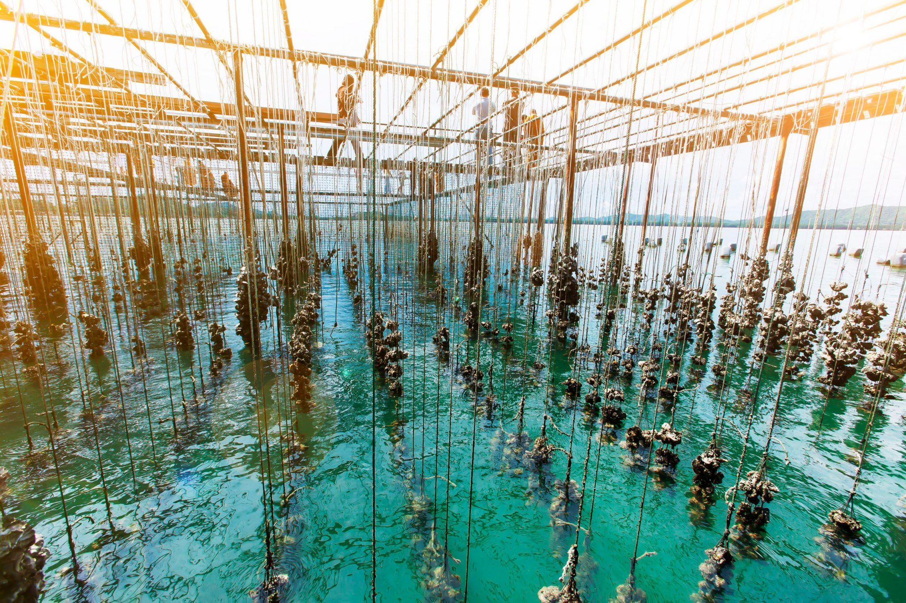

# AquaChat 🐟💬

<p align="center">
  
</p>

<p align="center">
  <b style="font-size:1.2em;">LLM-powered Chat for Aquaculture</b><br/>
  <i>Empowering sustainable fish farming with AI, inspired by <a href="https://kurma.ai/">Kurma AI</a></i>
</p>

---

<p align="center">
  
</p>

AquaChat is a beautiful, cross-platform chat application built with [Expo](https://expo.dev) and React Native. It leverages Large Language Models to provide real-time, intelligent support and recommendations for fish farming and marine ecosystem management. AquaChat supports multiple languages and offers a modern, responsive UI for seamless communication.

---

## ✨ Features

- ⚡ <b>Real-time chat interface</b> with smooth animations
- 🌎 <b>Multi-language support</b> (English, Spanish, French, etc.)
- 🎨 <b>Theming & custom splash screen</b>
- 🗂️ <b>File-based routing</b> for easy navigation
- 📱 <b>Works on iOS & Android</b>
- 🖼️ <b>Modern, visually appealing UI</b>

---

## 🚀 Getting Started

1. <b>Install dependencies</b>

   ```bash
   npm install
   ```

2. <b>Start the app</b>

   ```bash
   npx expo start
   ```

You can then open the app in:
- [Expo Go](https://expo.dev/go) on your device
- 🤖 Android emulator
- 🍏 iOS simulator

---

## 🤝 Contributing

Pull requests are welcome! For major changes, please open an issue first to discuss what you would like to change.

---

## 🌊 Community

- [Kurma AI on X (Twitter)](https://x.com/KurmaAI)
- [Kurma AI on LinkedIn](https://www.linkedin.com/company/kurmaai/)

---

<p align="center"><sub>© 2025 Kurma AI, Inc. All rights reserved  |  Made in USA 🇺🇸</sub></p>
